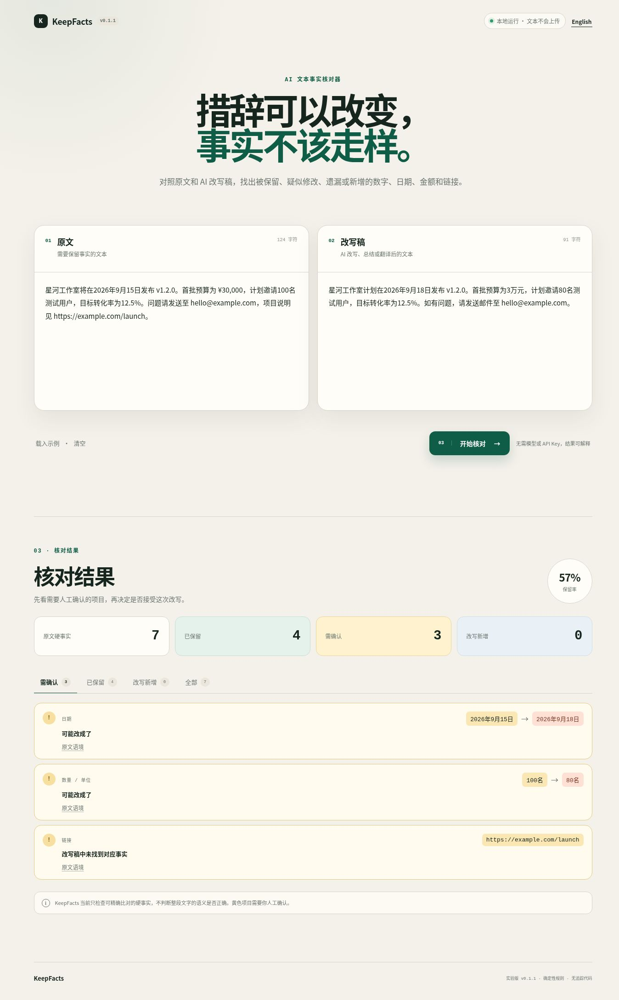

# KeepFacts

[简体中文](README.zh-CN.md) · [Live demo](https://masakinakao.github.io/keepfacts/)

[](https://masakinakao.github.io/keepfacts/)
[](https://github.com/MasakiNakao/keepfacts/actions/workflows/ci.yml)
[](https://github.com/MasakiNakao/keepfacts/releases/latest)
[](LICENSE)

**Change the wording, not the facts.**

KeepFacts is a small, privacy-first checker for facts that disappear or change during AI rewriting, summarization, and translation. Paste the source and the rewrite, then review dates, money, percentages, quantities, versions, links, emails, and other exact facts side by side.

All analysis runs locally in the browser. No text is uploaded, no account is required, and no AI API key is needed.

[](https://masakinakao.github.io/keepfacts/)

## Try it in 30 seconds

1. Open the [live demo](https://masakinakao.github.io/keepfacts/).
2. Paste the original text on the left and the rewrite on the right.
3. Optionally add one must-preserve name or phrase per line.
4. Select **Check the facts**, review yellow items, then copy or download the Markdown report.

## Why KeepFacts?

AI writing tools can produce fluent text while silently changing a date, dropping a URL, or turning 100 users into 80. KeepFacts provides a deterministic check before you accept the rewrite.

It is intentionally narrow:

- it finds exact, extractable facts;
- it explains every result;
- it flags uncertainty for human review;
- it does not claim to verify the meaning of the full document.

## Current checks

- Dates and times
- Money and percentages
- Quantities and common units
- Versions and numeric ranges
- URLs and email addresses
- Quoted text and standalone numbers
- Duplicate facts using occurrence-aware matching
- Chinese and English formatting equivalence for common facts
- User-defined names, terms, and phrases that must be preserved
- Copyable and downloadable Markdown review reports

## Run locally

Requirements: Node.js 22.13 or newer.

```bash
npm install
npm run dev
```

Run the tests:

```bash
npm test
```

Create a production build:

```bash
npm run build
```

## Validation

The repository includes a public, data-driven validation corpus covering
preserved, changed, missing, added, duplicate, and false-positive boundary
cases. See [VALIDATION.md](VALIDATION.md) for the current snapshot, reproduction
steps, matching guarantees, and known limitations.

## How matching works

KeepFacts extracts facts in priority order so nested numbers are not counted twice. It then normalizes safe formatting differences—for example, `¥30,000` and `3万元`—and performs occurrence-aware matching. Unmatched facts are shown as missing, possibly changed, or newly introduced.

No model is used in this process. The result is fast and reproducible, but deliberately limited to facts the rules can identify.

## Roadmap

- A reusable core package and CLI
- More locales, currencies, and unit aliases
- Browser extension and editor integrations
- Contributor-authored recognizer plugins

## Contributing

Bug reports and small, well-scoped recognizer improvements are welcome. When adding a rule, include tests for both a correct match and a likely false positive. See [CONTRIBUTING.md](CONTRIBUTING.md).

## Privacy and limitations

KeepFacts performs deterministic checks in your browser and contains no tracking code. It is an additional review aid, not a substitute for human review in legal, medical, financial, or other high-stakes work. See [SECURITY.md](SECURITY.md).

## License

MIT
