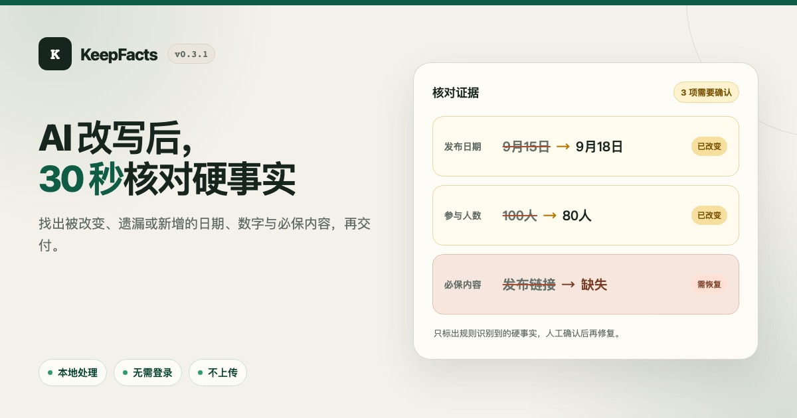

# KeepFacts

[简体中文](README.zh-CN.md) · [Live demo](https://masakinakao.github.io/keepfacts/?lang=en) · [Source](https://github.com/MasakiNakao/keepfacts) · [Privacy](SECURITY.md) · [Feedback](https://github.com/MasakiNakao/keepfacts/issues)

[](https://masakinakao.github.io/keepfacts/)
[](https://github.com/MasakiNakao/keepfacts/actions/workflows/ci.yml)
[](https://github.com/MasakiNakao/keepfacts/tags)
[](LICENSE)

**Change the wording, not the facts.**

[](https://masakinakao.github.io/keepfacts/?lang=en)

KeepFacts is a small, privacy-first **exact-fact preservation checker** for AI
rewrites, summaries, and translations. Compare a trusted source with the new
draft, then review dates, money, percentages, quantities, versions, links,
emails, and other extractable items side by side.

KeepFacts does not look up claims or decide whether they are true. It checks
whether exact items it can recognize were preserved, changed, omitted, or added
between two texts. Recognition is currently optimized for common Chinese and
English formats.

All analysis runs locally in the browser. KeepFacts does not automatically save
or upload your text; no account or AI API key is needed. Files you explicitly
export are unencrypted plaintext, as described under
[Privacy and limitations](#privacy-and-limitations).

## Try it in 30 seconds

1. Open the [live demo](https://masakinakao.github.io/keepfacts/?lang=en) and
   select the first action, **See 3 errors in 30 seconds**.
2. See three concrete demo findings immediately: the release date changed, the
   user count changed from 100 to 80, and the source URL is missing.
3. Select **Check my text**, then paste the trusted source on the left and
   the AI rewrite, summary, or translation on the right.
4. Optionally add one must-preserve name or phrase per line, then select
   **Compare both texts**. Work through the
   unified review queue, optionally add a note or expected fix, then copy the
   confirmed-only fix list or download the full Markdown report.
5. Recheck after editing either text. To continue later, explicitly export and
   re-import a local `.keepfacts.json` session. For non-sensitive feedback, use
   the visible **Feedback** link and never include private document text.

## Why KeepFacts?

AI writing tools can produce fluent text while silently changing a date,
dropping a URL, or turning 100 users into 80. KeepFacts provides a deterministic
pre-publication comparison before you accept the rewrite. The source text is
the reference; KeepFacts is not a truth-verification service.

It is intentionally narrow:

- it finds exact, extractable facts;
- it explains every result;
- it flags uncertainty for human review;
- it does not claim to verify truth or the meaning of the full document;
- its retention percentage covers only facts extracted from the source, not
  every factual statement the document may contain.

## v0.3.1 launch scope

v0.3.1 prepares the existing checker for its first X launch. The ready-to-run
example is now the first call to action and previews the same three differences
shown in its result. A dedicated 1200 × 630 social card, canonical URL, Open
Graph and X/Twitter metadata, and favicon make shared links identifiable.
Source, privacy, and feedback links stay visible, and mobile interactive
controls are at least 44 CSS pixels high.

The release retains the v0.3.0 human-review and handoff workflow. Automatic
warnings, must-preserve anomalies, and facts introduced only in the rewrite now
share one queue. Each item can carry a decision, optional note, and optional
expected fix; only confirmed issues enter the standalone fix list. A conservative recheck
migration preserves a decision only when the finding and its evidence still
match safely, and never silently assigns an ambiguous old record to a new item.

You can explicitly export or import a local `.keepfacts.json` session to move a
draft, its last checked input, and human records between browser sessions. The
file is strict, versioned, unencrypted plaintext; see
[Session format v1](docs/session-format-v1.md).

The fact-recognition engine and public evaluation corpus are unchanged from
v0.3.0. This launch-polish release does not demonstrate broader recognition or
improved accuracy. Use KeepFacts to check whether recognized exact facts survive
an AI transformation. A 100% extracted-fact retention result does not mean that every
claim is true, every fact was recognized, or the full meaning was preserved.

## Current checks

- Dates and times
- Money and percentages
- Quantities and common units
- Versions and numeric ranges
- URLs and email addresses
- Quoted text and standalone numbers
- Duplicate and reordered facts using context-aware, one-to-one matching
- Precision-safe signed numbers plus common Chinese, English, and full-width
  formatting equivalence
- User-defined names, terms, and phrases that must be preserved, reported
  separately from extracted-fact retention
- One human-review queue across automatic warnings, must-preserve anomalies,
  and newly added facts, with decisions, optional notes, optional expected
  fixes, and a next-pending action
- A confirmed-only Markdown fix list plus full traceable reports with bilateral
  context, human records, app version, and build commit
- Conservative record migration after rechecking: unchanged, uniquely matched
  evidence can retain its decision; changed evidence returns to pending, and
  ambiguous or unmatched records are not silently reassigned
- Explicit local import/export of versioned, unencrypted `.keepfacts.json`
  sessions; no automatic persistence or upload
- Fifty-item pagination for large automatic and must-preserve result sets
- Native radio-group decisions and focus-managed pagination, covered by
  responsive keyboard and browser accessibility checks

## Run locally

Requirements: Node.js 22.13 or newer.

```bash
npm ci
npm run dev
```

Run the tests:

```bash
npm test
```

Run the manually annotated evaluation corpus:

```bash
npm run eval
```

Run release metadata, Node tests, evaluation, type checks, and the production
build together:

```bash
npm run check
```

Create a production build:

```bash
npm run build
```

Install the Playwright Chromium browser, regenerate the committed social card,
and run browser and accessibility checks:

```bash
npx playwright install chromium
npm run render:share-card
npm run test:e2e
```

## Validation

The repository includes both fast regression cases and a realistic, manually
annotated public evaluation corpus. Evaluation reports extraction, alert,
added-fact, association, outcome, and normalization metrics rather than only
aggregate counts. See [VALIDATION.md](VALIDATION.md) and
[EVALUATION.md](EVALUATION.md) for the current snapshot and methodology.

## How matching works

KeepFacts extracts facts in priority order so nested numbers are not counted twice. It then normalizes safe formatting differences—for example, `¥30,000` and `3万元`—using exact decimal strings rather than floating-point arithmetic. Context-aware, one-to-one matching keeps repeated or reordered values attached to the most likely subject. Unmatched facts are shown as missing, possibly changed, or newly introduced.

No model is used in this process. Requested comparisons run in a local Web
Worker so large checks do not block text editing. Context features are cached
once per fact before one-to-one assignment, and result cards are paginated for
large documents. Results remain reproducible, but deliberately limited to facts
the rules can identify. The extracted-fact retention percentage is preserved
matches divided by extracted source facts; it is not an extraction-recall or
full-document accuracy score.

Human decisions are a separate review layer: they never rewrite automatic
counts or extracted-fact retention. KeepFacts does not automatically persist
source text, rewrite text, context, or review records in Web Storage. While the
page is open, that working state remains in memory. Reports or session files you
explicitly export may contain the text, contexts, decisions, notes, and expected
fixes in plaintext.

## Roadmap

- A reusable core package and CLI
- More locales, currencies, and unit aliases
- Browser extension and editor integrations
- Contributor-authored recognizer plugins

## Contributing

Bug reports and small, well-scoped recognizer improvements are welcome. When adding a rule, include tests for both a correct match and a likely false positive. See [CONTRIBUTING.md](CONTRIBUTING.md).

## Privacy and limitations

KeepFacts performs deterministic checks in your browser and contains no
tracking code. It compares supported exact facts between two texts; it does not
verify claims against external evidence. It is an additional review aid, not a
substitute for human review in legal, medical, financial, or other high-stakes
work.

KeepFacts does not automatically save or upload your text or review records.
However, an explicitly exported Markdown report or `.keepfacts.json` session is
an unencrypted plaintext file. A session includes the full source, rewrite,
must-preserve content, and human records; a report includes the findings and
their displayed context. Your browser download location, a cloud-synced folder,
backup software, or device indexing may copy or synchronize those files. Store,
share, and delete them accordingly. See [SECURITY.md](SECURITY.md) and the
[session format](docs/session-format-v1.md).

## License

MIT
